# AuthX - Break the Login: Security Audit Report

A Flask web application built in two versions to demonstrate common authentication vulnerabilities and their fixes.

- GitHub: https://github.com/dimaflorinalex/ProiectDASS
- Video: https://www.youtube.com/watch?v=tfYsnc_bE6k

**Team Members**  
- Dima Florin-Alexandru - Group 462, Faculty of Mathematics and Computer Science, University of Bucharest
- Assisted by Copilot (Claude Sonnet 4.6) for polishing documentation and increasing coverage of security fixes.

## Table of Contents

1. [Introduction](#1-introduction)
2. [Environment Setup](#2-environment-setup)
3. [MVP Implementation](#3-mvp-implementation)
4. [Vulnerability Overview (OWASP Mapping)](#4-vulnerability-overview)
5. [Proof of Concept - Attacks](#5-proof-of-concept--attacks)
   - [5.1 Weak Password Policy](#51-weak-password-policy)
   - [5.2 Insecure Password Storage](#52-insecure-password-storage)
   - [5.3 Brute Force / No Rate Limiting](#53-brute-force--no-rate-limiting)
   - [5.4 User Enumeration](#54-user-enumeration)
   - [5.5 Insecure Session Management](#55-insecure-session-management)
   - [5.6 Insecure Password Reset](#56-insecure-password-reset)
   - [5.7 IDOR on Ticket CRUD](#57-idor-on-ticket-crud)
6. [Impact Analysis](#6-impact-analysis)
7. [Fixes Implemented (v2)](#7-fixes-implemented-v2)
8. [Re-test After Fix](#8-re-test-after-fix)
9. [Audit & Logging](#9-audit--logging)
10. [Conclusions](#10-conclusions)

---

## 1. Introduction

### 1.1 Application Description

AuthX is a fictional internal portal used by employees to manage security tickets. The application supports two roles:

- **ANALYST** - can create, view, edit, and delete their own tickets
- **MANAGER** - can view and manage all tickets and access the audit log

The project covers the full authentication layer (login, registration, session management, password reset) as well as ticket CRUD operations, demonstrating both authentication failures and broken access control vulnerabilities. It was developed in two versions:

| Version | Purpose |
|---------|---------|
| `v1-vulnerable` | Intentionally insecure baseline for PoC demonstrations |
| `v2-secure` | Hardened implementation with all fixes applied |

### 1.2 Architecture

```
v1-vulnerable/          v2-secure/
├── app.py              ├── app.py
├── models.py           ├── models.py
├── requirements.txt    ├── requirements.txt
├── environment.yml     ├── environment.yml
└── templates/          └── templates/
    ├── base.html           ├── base.html
    ├── login.html          ├── login.html
    ├── register.html       ├── register.html
    ├── dashboard.html      ├── dashboard.html
    ├── forgot.html         ├── forgot.html
    ├── reset.html          ├── reset.html
    ├── tickets.html        ├── tickets.html
    └── audit.html          └── audit.html

poc/
├── poc_51_52_weak_password_storage.py
├── poc_53_brute_force.py
├── poc_54_user_enumeration.py
├── poc_55_insecure_session.py
└── poc_56_reset_token.py
```

**Stack:** Python 3.11, Flask 3.0, SQLite 3  
**Database tables:** `users`, `tickets`, `audit_logs`

### 1.3 Database Schema

```sql
users (id, email, password, role, created_at, locked)
tickets (id, title, description, severity, status, owner_id, created_at, updated_at)
audit_logs (id, user_id, action, resource, resource_id, ip_address, timestamp)
```

---

## 2. Environment Setup

### 2.1 Prerequisites

- [Miniconda](https://docs.conda.io/en/latest/miniconda.html) (or Anaconda)

### 2.2 Installation

Each version ships an `environment.yml` that pins all dependencies.

```bash
# v1 - vulnerable
conda env create -f v1-vulnerable/environment.yml
conda activate dass-v1

# v2 - secure
conda env create -f v2-secure/environment.yml
conda activate dass-v2
```

### 2.3 Running v1 (vulnerable)

```bash
cd v1-vulnerable
conda run -n dass-v1 --no-capture-output python app.py
```

Open `http://127.0.0.1:5000`

### 2.4 Running v2 (secure)

```bash
cd v2-secure
conda run -n dass-v2 --no-capture-output python app.py
```

Open `http://127.0.0.1:5001`

### 2.5 Default Accounts

Neither version seeds the database. Register accounts manually via `/register`. Role defaults to `ANALYST`.

To promote an account to **MANAGER**, run the following from the version's directory (where `authx.db` lives):

```bash
python -c "
import sqlite3
conn = sqlite3.connect('authx.db')
conn.execute(\"UPDATE users SET role='MANAGER' WHERE email='your@email.com'\")
conn.commit()
"
```

---

## 3. MVP Implementation

### 3.1 Register (`/register`)

Accepts `email` and `password` via POST form. Validates that fields are present, inserts user into `users` table, records a `REGISTER` event in `audit_logs`.

**v1 flaw:** No password complexity check. Password stored as MD5 hash.  
**v2 fix:** Strong password policy enforced. bcrypt with auto-generated salt.

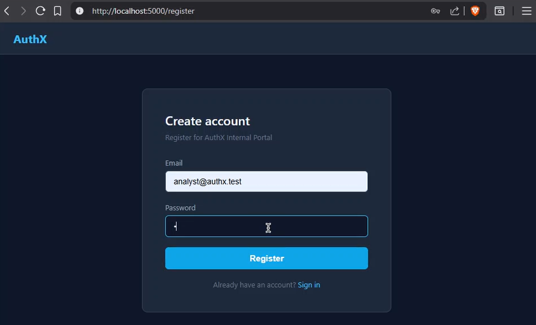

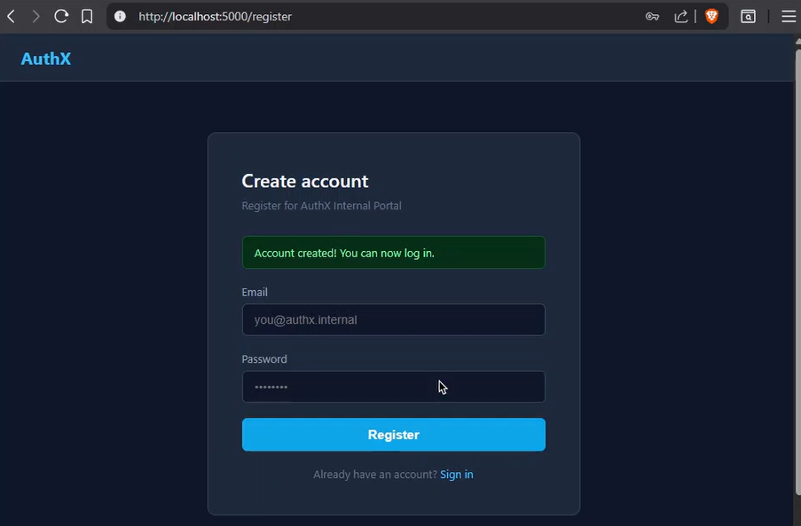

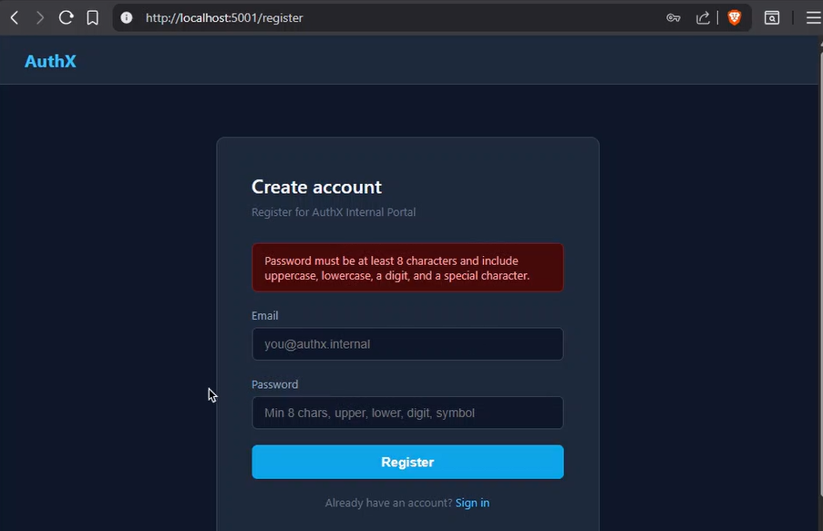

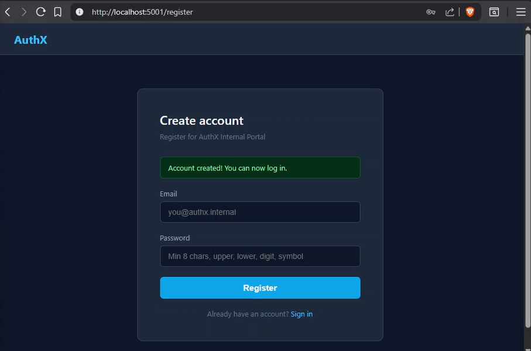

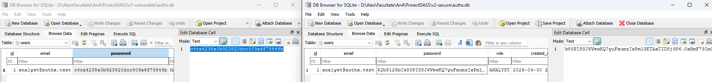

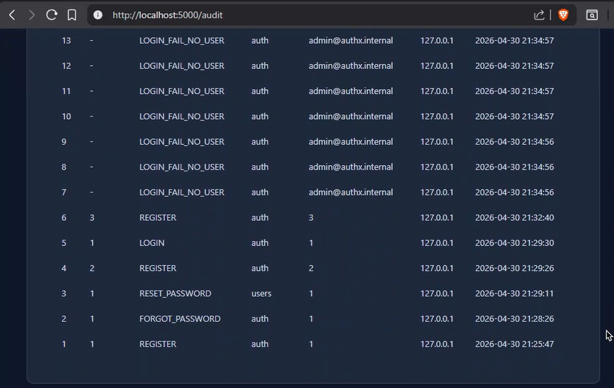

### 3.2 Login (`/login`)

Accepts `email` + `password`. Looks up user in DB, compares password hash, sets a session cookie on success.

**v1 flaw:** MD5 comparison, different error messages for missing user vs. wrong password, cookie is just the user `id`.  
**v2 fix:** bcrypt comparison, generic "Invalid credentials" for all failures, random session token with security flags.

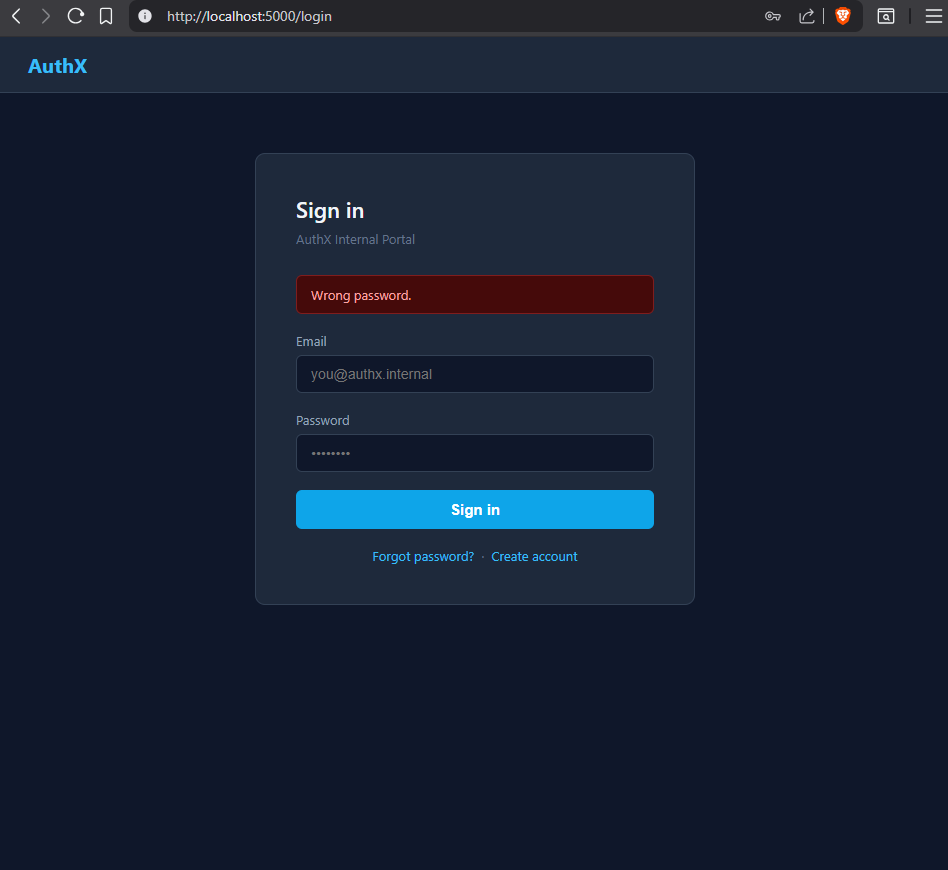

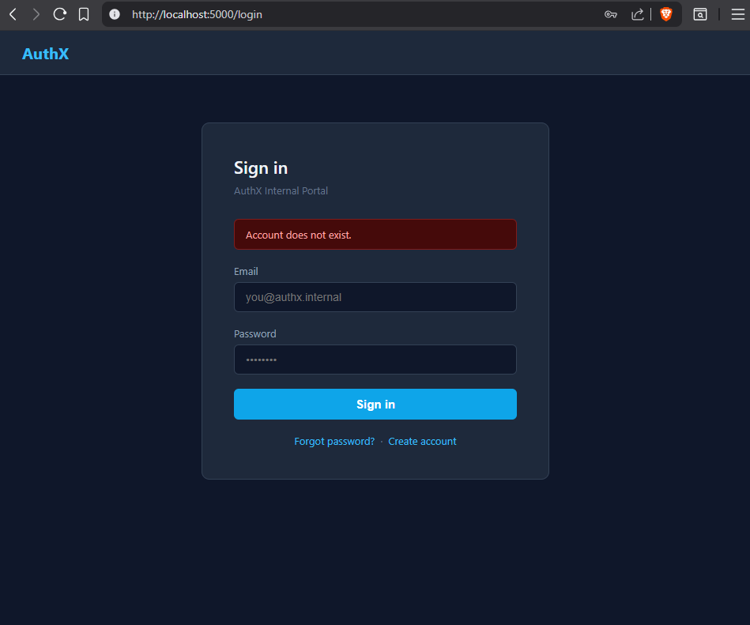

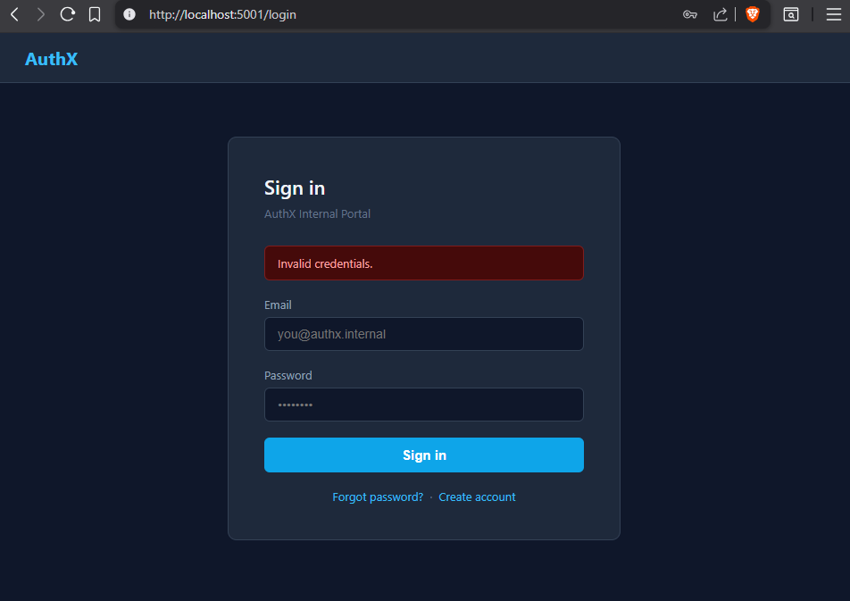

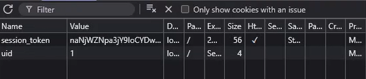

### 3.3 Logout (`/logout`)

Clears the session cookie. In v2, also removes the token from the server-side `sessions` dict so the token cannot be reused.

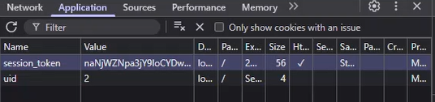


### 3.4 Password Reset (`/forgot-password`)

User submits email → app generates a reset token → link shown on page (simulating email delivery).

**v1 flaw:** Token is `tok-{user_id}-reset`, reusable, no expiry.  
**v2 fix:** `secrets.token_urlsafe(32)`, 15-minute expiry, invalidated after first use.

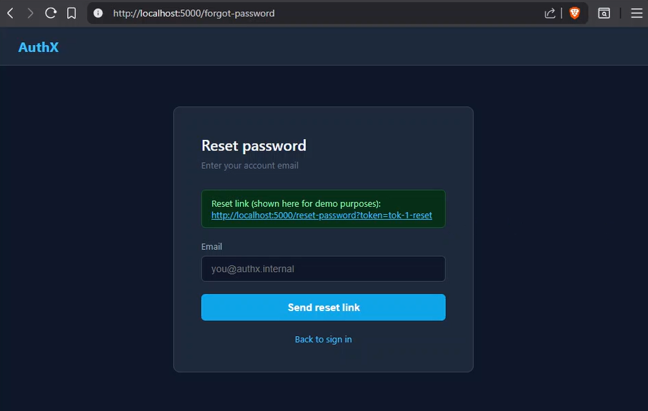

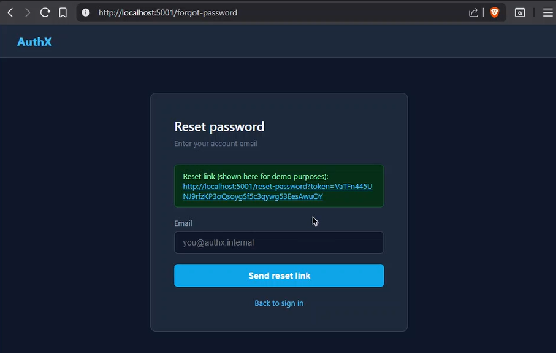

### 3.5 Session Management

v1 uses a plain `uid` cookie (the integer user id).  
v2 uses a 32-byte random token stored in a server-side dict, transmitted via `HttpOnly; SameSite=Strict; max-age=1800` cookie.


### 3.6 Ticket CRUD (`/tickets`, `/tickets/<id>/edit`, `/tickets/<id>/delete`)

The tickets page supports the full create-read-update-delete lifecycle:

| Operation | Endpoint | Method |
|-----------|----------|--------|
| Create | `POST /tickets` | Form submission on the ticket list page |
| Read | `GET /tickets` | Lists all (MANAGER) or own (ANALYST) tickets; supports `?q=` search |
| Update | `POST /tickets/<id>/edit` | Edit form pre-filled with current values; title, description, severity, status |
| Delete | `POST /tickets/<id>/delete` | Removes the ticket and redirects back to the list |

**v1 flaw:** No ownership check on update/delete — IDOR allows any authenticated user to modify or delete any ticket.  
**v2 fix:** Ownership enforced before every write; only the ticket owner or a MANAGER may edit or delete.


---

## 4. Vulnerability Overview

| # | Category | OWASP Reference | v1 Flaw |
|---|----------|----------------|---------|
| 4.1 | Weak Password Policy | A07:2021 - Identification and Authentication Failures | Any password accepted |
| 4.2 | Insecure Password Storage | A02:2021 - Cryptographic Failures | MD5 without salt |
| 4.3 | Brute Force / No Rate Limiting | A07:2021 - Identification and Authentication Failures | Unlimited login attempts |
| 4.4 | User Enumeration | A07:2021 - Identification and Authentication Failures | Distinct error messages |
| 4.5 | Insecure Session Management | A07:2021 - Identification and Authentication Failures | Predictable cookie, no flags |
| 4.6 | Insecure Password Reset | A07:2021 - Identification and Authentication Failures | Predictable, reusable token |
| 4.7 | IDOR on Tickets | A01:2021 - Broken Access Control | No ownership check on edit/delete |

---

## 5. Proof of Concept - Attacks

### 5.1 Weak Password Policy

**Vulnerability:** v1 accepts passwords of any length and complexity, including single characters.

**PoC script:** `poc/poc_51_52_weak_password_storage.py`

```bash
cd v1-vulnerable
python app.py            # terminal 1
# terminal 2:
python ../poc/poc_51_52_weak_password_storage.py
```

Expected output:
```
[*] Registering with weak password: 'a'
    HTTP 201
[*] Reading password hash directly from database...
    email        : poc_weak@authx.internal
    password hash: 60b725f10c9c85c70d97880dfe8191b3
[!] MD5 hash is fast and unsalted - trivially reversible with any online cracker.
```

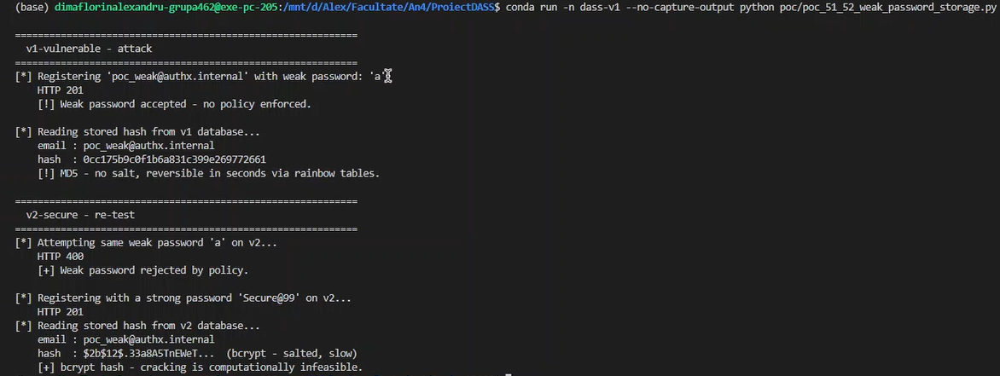

**Impact:** An attacker who obtains the database can crack all passwords instantly with rainbow tables or online MD5 lookup services.

---

### 5.2 Insecure Password Storage

**Vulnerability:** Passwords are hashed with MD5, which is a fast, unsalted algorithm. MD5 has been broken for password storage purposes for over a decade.

```python
# v1 - insecure
def weak_hash(password: str) -> str:
    return hashlib.md5(password.encode()).hexdigest()
```

**PoC:** Same script as 4.1 - the database dump shows the raw MD5 hash.


---

### 5.3 Brute Force / No Rate Limiting

**Vulnerability:** v1 has no attempt counter, lockout mechanism or delay. An attacker can make thousands of requests per second.

**PoC script:** `poc/poc_53_brute_force.py`

```bash
python ../poc/poc_53_brute_force.py
```

Expected output (abbreviated):
```
[*] Brute-forcing admin@authx.internal with 15 passwords...

    123456               -> fail (401)
    password             -> fail (401)
    qwerty               -> fail (401)
    ...
[!] All requests completed without any block or lockout.
```

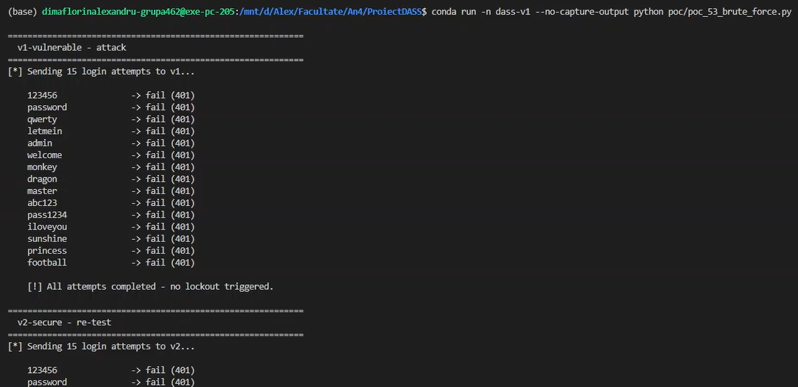

---

### 5.4 User Enumeration

**Vulnerability:** v1 returns `"Account does not exist."` for an unknown email and `"Wrong password."` for a wrong password on an existing account. This lets an attacker distinguish valid emails from invalid ones.

**PoC script:** `poc/poc_54_user_enumeration.py`

```bash
python ../poc/poc_54_user_enumeration.py
```

Expected output:
```
[*] Probing with an email that does NOT exist:
    HTTP 401  |  "Account does not exist."

[*] Probing with an email that EXISTS (wrong password):
    HTTP 401  |  "Wrong password."

[!] Different messages allow enumeration of valid accounts.
```

**Impact:** Attacker builds a list of valid usernames, then targets only those accounts in a credential-stuffing or brute-force attack.

---

### 5.5 Insecure Session Management

**Vulnerability:** After login, v1 sets a cookie `uid=<integer>`, which:
- Is the user's database ID (predictable)
- Has no `HttpOnly` flag (accessible from JavaScript - XSS risk)
- Has no `Secure` flag (sent over plain HTTP)
- Has no `SameSite` attribute (CSRF risk)
- Never expires

**PoC script:** `poc/poc_55_insecure_session.py`

```bash
python ../poc/poc_55_insecure_session.py
```

Expected output:
```
[*] Logging in with legitimate credentials...
    Set-Cookie uid = '1'
    Cookie has no HttpOnly, Secure or SameSite flags.

[*] Forging session for user id=1 (likely the first registered admin)...
    HTTP 200
    [!] Dashboard loaded for user id=1 without knowing the password!
```


---

### 5.6 Insecure Password Reset

**Vulnerability:** The reset token is `tok-{user_id}-reset` - directly derived from the user id. It has no expiry and can be used multiple times.

**PoC script:** `poc/poc_56_reset_token.py`

```bash
python ../poc/poc_56_reset_token.py
```

Expected output:
```
[*] Guessed token for user id=1: 'tok-1-reset'
[*] First reset attempt...
    HTTP 200
    [!] Password successfully changed without owning the account!

[*] Second reset attempt with the same token (reuse test)...
    HTTP 200
    [!] Token accepted a second time - it is reusable (no invalidation).
```


### 5.7 IDOR on Ticket CRUD

**Vulnerability:** v1's edit and delete endpoints accept a ticket `id` from the URL path without verifying that the requesting user owns that ticket. Any authenticated user can modify or delete any ticket by crafting a request to `/tickets/<id>/edit` or `/tickets/<id>/delete`.

**PoC:** Register two accounts (User A and User B). Log in as User A and create a ticket. Note its id. Log out and log in as User B. Send:

```
POST /tickets/<user_a_ticket_id>/delete
```

**Impact:** Any authenticated employee can tamper with or destroy another user's tickets, breaking data integrity and confidentiality.

---

## 6. Impact Analysis

| Vulnerability | What an attacker gains |
|---------------|----------------------|
| 4.1 Weak policy | Accounts protected by trivial passwords; exploitable immediately |
| 4.2 MD5 storage | Full plaintext passwords recovered from a database dump in seconds |
| 4.3 No rate limiting | Automated password guessing against any account |
| 4.4 User enumeration | Valid email list for targeted attacks, phishing, credential stuffing |
| 4.5 Insecure session | Account takeover by guessing/forging cookie; XSS can steal it |
| 4.6 Weak reset token | Account takeover for any user by guessing their reset token |
| 4.7 IDOR on tickets | Any authenticated user can edit or delete another user's tickets |

---

## 7. Fixes Implemented (v2)

### 7.1 - Strong Password Policy

```python
def is_strong_password(password: str) -> bool:
    return (
        len(password) >= 8
        and bool(re.search(r"[A-Z]", password))
        and bool(re.search(r"[a-z]", password))
        and bool(re.search(r"\d", password))
        and bool(re.search(r'[!@#$%^&*()\-_=+\[\]{}|;:,.<>?/]', password))
    )
```


### 7.2 - bcrypt with Salt

```python
hashed = bcrypt.hashpw(password.encode(), bcrypt.gensalt()).decode()
```

### 7.3 - Rate Limiting & Account Lockout

After 5 failed attempts the account is blocked for 5 minutes. All failed attempts are written to `audit_logs`.

### 7.4 - Generic Error Message + Timing Equalisation

```python
# Always run bcrypt to prevent timing oracle
dummy = bcrypt.hashpw(b"__dummy__", bcrypt.gensalt())
if user:
    valid = bcrypt.checkpw(password.encode(), user["password"].encode())
else:
    bcrypt.checkpw(password.encode(), dummy)
    valid = False

# Enforce minimum 0.5 s response time
elapsed = time.monotonic() - start
if elapsed < 0.5:
    time.sleep(0.5 - elapsed)
```

Single generic error: `"Invalid credentials."`

### 7.5 - Secure Session Cookie

```python
resp.set_cookie(
    "session_token",
    session_token,
    httponly=True,
    secure=False,       # set True when serving over HTTPS
    samesite="Strict",
    max_age=1800,
)
```

- Token: `secrets.token_urlsafe(32)` (256-bit random)
- Server-side `sessions` dict; cleared on logout
- 30-minute expiry

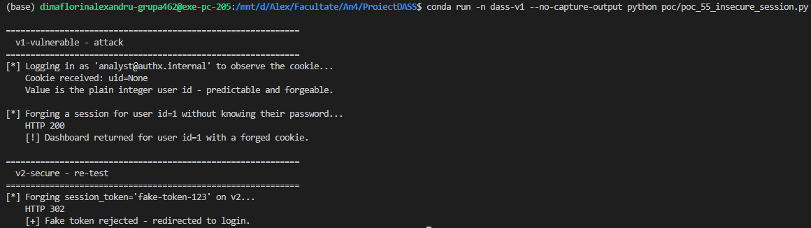

### 7.6 - Secure One-Time Reset Token

```python
token = secrets.token_urlsafe(32)
reset_tokens[token] = {
    "user_id": user["id"],
    "expires": datetime.now() + timedelta(minutes=15),
}
```

Token is deleted from `reset_tokens` on first use.

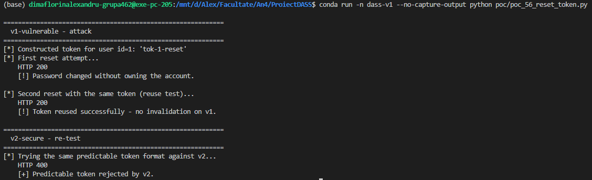

### 7.7 - Ownership Enforcement on Ticket CRUD

```python
# Access control: only the owner or a MANAGER may edit/delete
if ticket["owner_id"] != user["id"] and user["role"] != "MANAGER":
    record_event(user["id"], "UNAUTHORIZED_TICKET_EDIT", "tickets", str(ticket_id))
    return redirect(url_for("tickets"))
```

The check runs before any database write. Unauthorized attempts are silently redirected and recorded in `audit_logs`. The template additionally hides Edit/Delete buttons for rows the current user does not own (defence in depth).

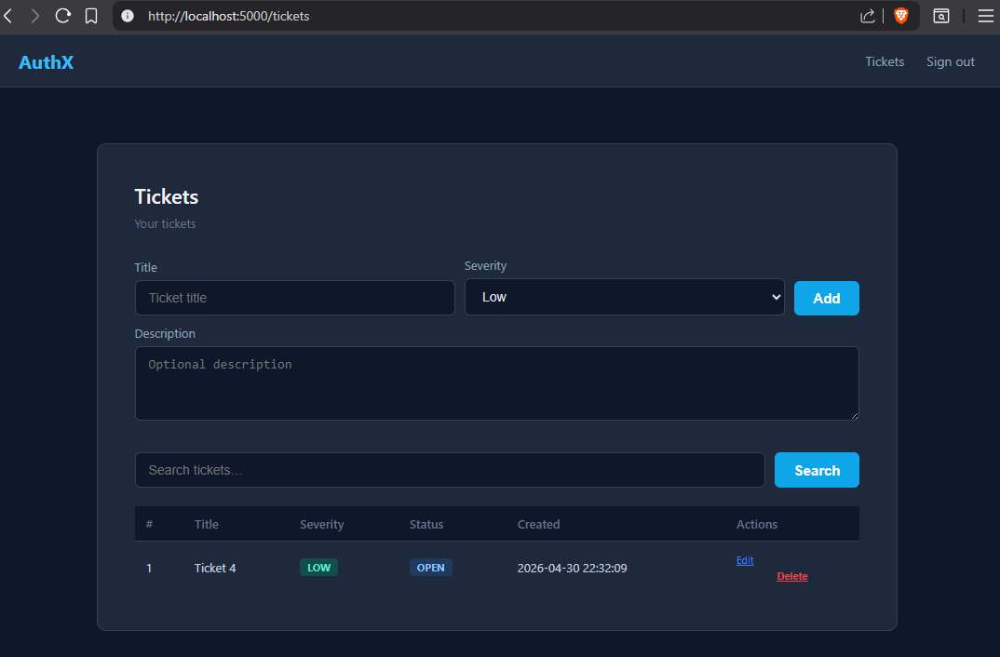


---

## 8. Re-test After Fix

| # | PoC script | v1 result | v2 result |
|---|-----------|-----------|-----------|
| 5.1 | `poc_51_52_weak_password_storage.py` | HTTP 201, password `a` accepted | HTTP 400, policy error |
| 5.2 | DB dump | MD5 hash visible | `$2b$…` bcrypt hash |
| 5.3 | `poc_53_brute_force.py` | All 15 requests succeed | Blocked after attempt 5 (HTTP 429) |
| 5.4 | `poc_54_user_enumeration.py` | Two distinct messages | Single generic message for both |
| 5.5 | `poc_55_insecure_session.py` | `uid=1` forges session | Random token; forged value rejected |
| 5.6 | `poc_56_reset_token.py` | Token reused successfully | Second use returns 400 |
| 5.7 | Manual (browser / curl) | Delete User A's ticket as User B | Silently redirected; audit event logged |

---

## 9. Audit & Logging

Every significant action is recorded in `audit_logs` with the user id, action name, resource, and client IP address.

Logged actions: `LOGIN`, `LOGIN_FAIL`, `LOGIN_FAIL_NO_USER`, `LOGIN_FAIL_WRONG_PASS`, `REGISTER`, `LOGOUT`, `FORGOT_PASSWORD`, `RESET_PASSWORD`, `CREATE_TICKET`, `UPDATE_TICKET`, `DELETE_TICKET`, `UNAUTHORIZED_TICKET_EDIT` (v2 only), `UNAUTHORIZED_TICKET_DELETE` (v2 only).

Managers can view the log at `/audit`.

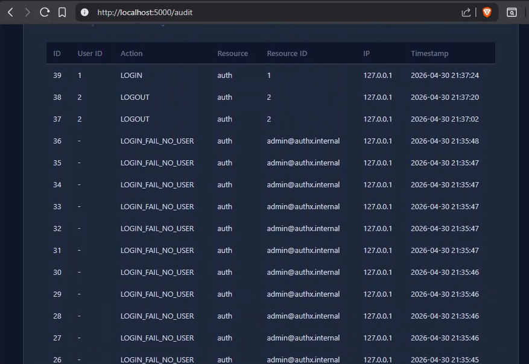

---

## 10. Conclusions

The project demonstrated the complete vulnerability-attack-fix cycle for six common authentication weaknesses mapped to OWASP A07:2021 - Identification and Authentication Failures.

Key lessons:

- **Never store passwords in plaintext or with fast hashes** (MD5/SHA-1). bcrypt, scrypt or Argon2 must be used.
- **Rate limiting is a critical control** even for low-traffic applications; a simple counter with a lockout is sufficient.
- **Generic error messages prevent user enumeration** and should be the default for all authentication endpoints.
- **Session tokens must be random, server-validated, and tied to secure cookie attributes** - an integer user id is never an acceptable session identifier.
- **Password reset tokens are credentials** and must be treated as such: cryptographically random, short-lived, and single-use.
- **Access control must be enforced server-side on every write operation** — hiding UI elements is not a substitute. IDOR vulnerabilities arise whenever the backend trusts a client-supplied resource id without verifying ownership.
- **Audit logging** provides traceability and is the first tool for incident response.
